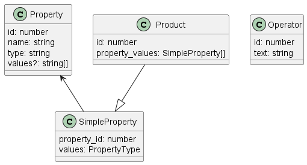

# How I developed this application

I chose React simply because it is the web framework I am most familiar with, and because Salsify also uses a JavaScript web framework (Ember.js).

## Assumptions
Following the recommendations on the exercise's Github page:
- No other Operators or data types will be introduced; they are considered static
- Properties and Products can change, and the solution does not assume otherwise

The datasource file given suffered a small change just to allow for a cleaner and more correct integration in a React project:

                export const datastore = {
                    ...
                }

## Structure
The project's folder structure is as follows:
- components: Components such as Table and Filters - functions that return "building blocks" necessary to build a page, and that can be reusable if necessary.
- constants: Values that remain constant and are necessary throughout the entire project
- domain: The domain classes of the project, necessary to fully understand the objects we are manipulating
- mocks: Contains the datasource provided
- pages: Contains all the pages that the user can access in the application. In this case, it's just the main App.tsx.
- services: Contains classes responsible for actions that might be out of the scope of the components. It could be to call a backend server, or a utilitary class that is domain-agnostic. In this case, we only have FilteringService.ts, responsible for filtering the product list. 

### Domain Classes

### Components
The UI library used was [Chakra UI](https://chakra-ui.com/), a lightweight React component library. It was my first time using it on an application, but I still decided to use it as I was looking to try it for a while. 

- ProductTable.tsx: this component consists of a simple Table, responsible for displaying all the products fetched from the datasource.

- Filters.tsx: this component consists of the three Filters (Property, Operator and Value), as well as a button to Clear all the Filters.

## Testing

In order to test the application, I used [Jest](https://jestjs.io/), a popular JavaScript testing framework.
Due to time constraints and for practicality's sake, I decided to unit test FilteringService.tsx and develop some integration tests for App.tsx.

## Time spent & Final Considerations

I took my time with this project, not just because there was no hard deadline but also because the week during which it was developed was a particularly chaotic one, from a professional and academic standpoint. \
I probably took between 8 and 10 hours, with at least 2 of those hours being dedicated to thinking about the best solution and design for the project, and 2 others being dedicated to the testing and writing documentation/code cleanup. This time was spread throughout the whole week (from Saturday through Friday).

The user interface was intentionally left relatively bare-bones, in order to fully focus on the software solution itself.

Overall, I believe the solution completely fulfills the requirements proposed, while also being technically sound and readable. If I had more time, I would:

- Do _a lot_ more tests
- Implement error handling and input validation
- Create a more appealing and user friendly interface

# How to use this application

## Start

In order to start this app, run `npm start`. This runs the app in development mode.\
Open [http://localhost:3000](http://localhost:3000) to view it in the browser.

The page will reload if you make edits.\
You will also see any lint errors in the console.

## Test

In order to run the unit tests, run `npm test`. \
This launches the test runner in the interactive watch mode.\
See the documentation about [running tests](https://facebook.github.io/create-react-app/docs/running-tests) for more information.

## Build

In order to build the app for production, run `npm run build`.
This builds the app for production to the `build` folder.\
It correctly bundles React in production mode and optimizes the build for the best performance.
The build is minified and the filenames include the hashes.\
The app is now ready to be deployed.

# Learn More

This project was bootstrapped with [Create React App](https://github.com/facebook/create-react-app).

You can learn more in the [Create React App documentation](https://facebook.github.io/create-react-app/docs/getting-started).

To learn React, check out the [React documentation](https://reactjs.org/).
